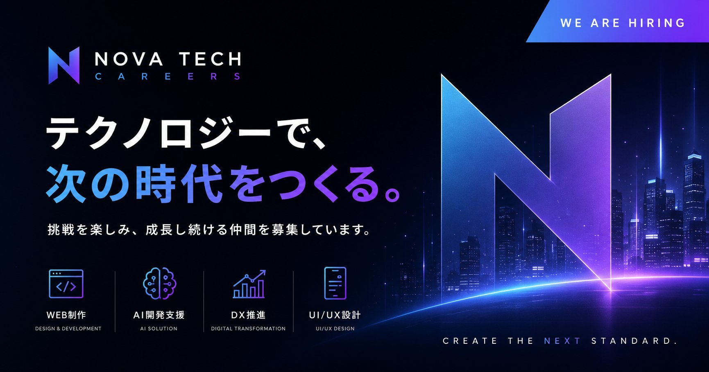
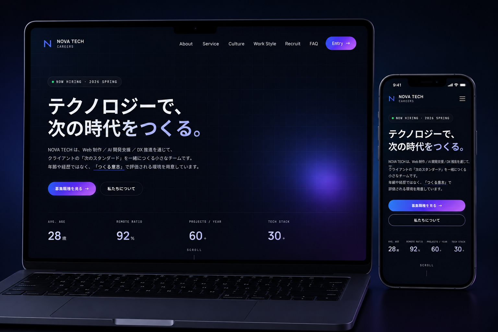
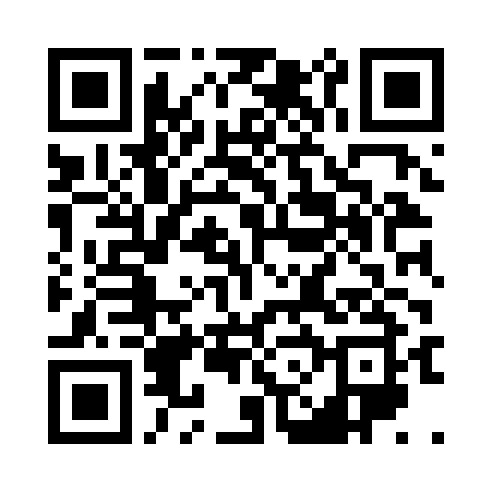

<p align="center">
  
</p>

<h1 align="center">NOVA TECH CAREERS — 制作企画書</h1>

<p align="center">
  <strong>Portfolio Proposal · 2026</strong><br>
  採用 LP の「設計意図」と「実装プロセス」を記録したポートフォリオ資料
</p>

<p align="center">
  
  
  
  
</p>

<p align="center">
  🔗 <a href="https://hirotonozaki.github.io/nova-tech-careers-proposal/">View Proposal</a>
  &nbsp;·&nbsp;
  🌐 <a href="https://hirotonozaki.github.io/nova-tech-careers/">Live Site</a>
</p>

<p align="center">
  <sub>※ 本企画書は <strong>A4 横の資料として設計</strong> されています。PC ／ タブレット（横向き）での閲覧を推奨します。</sub>
</p>

---

## 📖 Overview ／ 企画書概要

採用 LP「**NOVA TECH CAREERS**」を制作するにあたっての、戦略・UI/UX 設計・デザイン意図・マーケティング視点・実装設計・WordPress 化想定・振り返りまでを 1 冊にまとめた制作企画書です。

「ただ綺麗なサイトを作る」のではなく、**採用課題を解決する LP として何ができるか**を起点に、設計 → デザイン → 実装 → 公開までの過程を記録しています。HTML / CSS で構築し、ブラウザ閲覧と A4 横の PDF 出力の両方に対応しています。

| 項目 | 内容 |
| --- | --- |
| ドキュメント | Design / Development Proposal |
| 対象サイト | NOVA TECH CAREERS — 採用 LP |
| 構成 | A4 横・全 13 ページ（全 11 セクション） |
| 形式 | HTML / CSS（PDF 出力対応） |
| 用途 | ポートフォリオ提出資料 |

---

## 🎯 Purpose ／ 目的

この企画書は、完成したサイトそのものではなく「**そのサイトをなぜ・どう作ったか**」を伝えることを目的としています。

- 制作物の背後にある思考プロセス（課題定義 → 仮説 → 設計判断）を可視化する
- 「実案件を想定した進め方」を意識した、実務に近い手順を示す
- デザイン・実装の一つひとつの判断に「成果視点での理由」を添える

---

## 🗂 Contents ／ 構成内容

全 11 セクションを 4 つの章に分けて構成しています。

| 章 | No. | セクション |
| --- | --- | --- |
| **I. STRATEGY** | 01 | プロジェクト概要 |
| | 02 | サイト設計 ／ UI・UX |
| | 03 | ファーストビュー ／ CTA 設計 |
| **II. DESIGN & BUILD** | 04 | デザインコンセプト |
| | 05 | 技術構成 ／ 開発環境 |
| | 06 | 実装ポイント |
| **III. RESULT** | 07 | Web マーケティング視点 |
| | 08 | WordPress 化想定 |
| **IV. REFLECTION** | 09 | 苦労した点 |
| | 10 | 学んだこと |
| | 11 | 公開リソース ／ Closing |

---

## 🖼 Preview ／ プレビュー

<p align="center">
  
</p>

> 表紙では対象サイトのヒーローイメージを配置し、企画書全体のトーン（黒ベース × 青紫グラデーション）を冒頭で提示しています。各セクションは「英語見出し ＋ 日本語タイトル」で統一し、資料全体の一貫性を保っています。

実際の企画書は以下から確認できます。

- 📄 **HTML 版** — https://hirotonozaki.github.io/nova-tech-careers-proposal/

---

## ✏️ Editorial Policy ／ 企画書で意識したこと

- **結論から書く** — 各セクションは「何を解決するか」を冒頭で提示し、根拠を後に続ける構成
- **判断の言語化** — 「なぜこの色か」「なぜこの構造か」を、感覚ではなく理由として明記
- **成果視点の一貫** — 装飾の説明ではなく、CVR・離脱率といった指標に紐づけて記述
- **読み手への配慮** — 採用担当者・エンジニア双方が読むことを想定し、専門用語に簡潔な補足を添える

---

## 🎨 Design Direction ／ デザイン方針

企画書自体も、対象サイトと同じビジュアル言語で設計しています。

| 要素 | 方針 |
| --- | --- |
| Color | 背景 `#0a0b14` の漆黒に、青紫グラデーションをアクセントとして限定使用 |
| Typography | 英語見出し（Manrope）＋ 日本語（Noto Sans JP）＋ コード（JetBrains Mono） |
| Layout | A4 横を基準に、左右 2 カラムのカード型レイアウトで情報を整理 |
| Heading | 「番号 ＋ 英語見出し ＋ 日本語タイトル」を全セクションで統一 |

---

## 🧭 Information Architecture ／ 情報設計

読み手が「戦略 → 制作 → 成果 → 振り返り」という流れで思考を追えるよう、章立てを設計しています。

- 各セクションは独立して読めるよう、1 セクション＝見開きで完結させる
- カード型レイアウトで「並列の情報」を視覚的にグルーピング
- 重要な設計判断は、本文と区別したコールアウトで強調
- ページ番号・章ラベルをフッターに常駐させ、現在地を見失わせない

---

## 🖥 Viewing Environment ／ 閲覧環境について

本企画書は **A4 横（1280 × 900px 相当）の資料として設計** しており、PC ／ タブレット（横向き）での閲覧を推奨します。

| デバイス | 推奨度 | 補足 |
| --- | --- | --- |
| PC（横幅 1280px 以上） | ◎ 推奨 | 制作時の意図通りに表示されます |
| タブレット（横向き） | ◯ | iPad 横向きなど、1024px 以上の横幅で問題なく閲覧可能 |
| スマートフォン | △ | A4 横レイアウトのため、ピンチイン／横スクロールでの閲覧となります。資料の性質上、可能であれば PC での閲覧を推奨します |

> 紙資料を PDF として読む感覚に近い体験を意図しているため、レスポンシブ縮小ではなく **元のレイアウトをそのまま保持** する設計を選択しました。

---

## 📄 About PDF ／ PDF 出力について

本企画書は HTML / CSS で構築し、`@media print` と `@page` の指定により、ブラウザの印刷機能から **A4 横・全 13 ページ**の PDF として出力可能です。

```
ブラウザで index.html を開く
  → 印刷（Ctrl / Cmd + P）
  → 用紙: A4 横 ／ 余白: なし ／ 背景グラフィック: 有効
  → PDF として保存
```

HTML 版・PDF 出力時の見た目が一致するよう、Web フォントの読み込みと印刷時のレイアウトを調整しています。

---

## ⚙️ Tech Stack ／ 使用技術

| 領域 | 技術 |
| --- | --- |
| Markup | HTML5 |
| Styling | CSS3 / CSS Variables |
| Print | `@page` / `@media print`（A4 出力対応） |
| Font | Google Fonts（Manrope / Noto Sans JP / JetBrains Mono） |
| Hosting | GitHub Pages |

---

## 📂 Directory Structure ／ フォルダ構成

```
nova-tech-careers-proposal/
├── index.html                    # 企画書本体（全 13 ページ）
├── README.md                     # このファイル
├── css/
│   └── style.css                 # スタイル（A4 ページ設計・配色）
└── assets/
    └── images/
        ├── ogp.jpg               # 表紙・README ヒーロー用ビジュアル
        ├── preview-mockup.png    # README プレビュー画像
        └── qr.jpg                # 公開サイトへの QR コード
```

---

## 🌐 Links ／ 公開 URL

| リソース | URL |
| --- | --- |
| 企画書（HTML） | https://hirotonozaki.github.io/nova-tech-careers-proposal/ |
| 企画書リポジトリ | https://github.com/hirotonozaki/nova-tech-careers-proposal |
| 対象サイト（Live） | https://hirotonozaki.github.io/nova-tech-careers/ |
| サイトリポジトリ | https://github.com/hirotonozaki/nova-tech-careers |

### 💻 GitHub Repository

https://github.com/hirotonozaki/nova-tech-careers-proposal

---

## 📲 Mobile Preview ／ スマホで確認

<p align="center">
  
</p>

QR コードを読み取ると、対象サイトをスマートフォン実機でご確認いただけます。

---

## 👤 Author ／ 制作者情報

| 項目 | 内容 |
| --- | --- |
| Name | Hiroto Nozaki |
| School | Digital Hollywood STUDIO |
| Role | Web Director / Frontend Learner |
| Skills | HTML / CSS / JavaScript / WordPress / GitHub / UI Design |

---

<p align="center">
  <sub>NOVA TECH CAREERS はポートフォリオ用に制作した架空企業です。掲載内容はすべてフィクションです。</sub>
</p>
