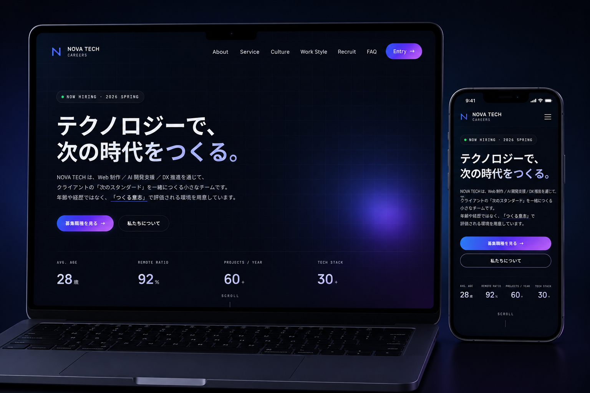

[README.md](https://github.com/user-attachments/files/28135089/README.md)
<div align="center">

# NOVA TECH CAREERS — Proposal

**設計意図と実装プロセスを、1冊に。**

採用 LP「NOVA TECH CAREERS」の戦略・UI/UX 設計・デザイン意図・実装設計・振り返りまでを
A4 横・全13ページにまとめた制作企画書です。

<br />



<br />

[**📄 View Proposal**](https://hirotonozaki.github.io/nova-tech-careers-proposal/) ・ [**🌐 Live Site**](https://hirotonozaki.github.io/nova-tech-careers/) ・ [**📁 Repository**](https://github.com/hirotonozaki/nova-tech-careers-proposal)

<br />


</div>

<br />

## 📖 Overview ／ 概要

採用 LP「NOVA TECH CAREERS」を制作するにあたっての、**戦略・UI/UX 設計・デザイン意図・マーケティング視点・実装設計・WordPress 化想定・振り返り**までを1冊にまとめた制作企画書です。「ただ綺麗なサイトを作る」のではなく、採用課題を解決する LP として何ができるかを起点に、設計 → デザイン → 実装 → 公開までの過程を記録しました。

| Item | Detail |
| :--- | :--- |
| **Project Type** | 制作企画書（ポートフォリオ） |
| **Sections** | A4 横・全13ページ／11セクション |
| **Format** | HTML / CSS（PDF 出力対応） |
| **Role** | 企画 / 情報設計 / デザイン / 実装 |
| **Stack** | HTML5 / CSS3（フレームワーク不使用） |
| **Hosting** | GitHub Pages |

<br />

## 🌐 Live Site ／ サイトURL

https://hirotonozaki.github.io/nova-tech-careers-proposal/

> ※ 本企画書は **A4 横の資料として設計** されています。PC ／ タブレット（横向き）での閲覧を推奨します。

<br />

## 💻 GitHub ／ リポジトリ

https://github.com/hirotonozaki/nova-tech-careers-proposal

<br />

## 🛠 Tech Stack ／ 使用技術

| 領域 | 技術 |
| :--- | :--- |
| **Markup** | HTML5 |
| **Styling** | CSS3 / CSS Variables |
| **Print** | `@page` / `@media print`（A4 出力対応） |
| **Typography** | Manrope / Noto Sans JP / JetBrains Mono（Google Fonts） |
| **Hosting** | GitHub Pages |

<br />

## 💡 Concept ／ 制作意図

> この企画書は、完成したサイトそのものではなく「**そのサイトをなぜ・どう作ったか**」を伝えることを目的としています。

- 制作物の背後にある思考プロセス（課題定義 → 仮説 → 設計判断）を可視化する
- 「実案件を想定した進め方」を意識した、実務に近い手順を示す
- デザイン・実装の一つひとつの判断に「成果視点での理由」を添える

企画書自体も、対象サイトと同じビジュアル言語で設計しています。

| 要素 | 方針 |
| :--- | :--- |
| **Color** | 背景 `#0a0b14` の漆黒に、青紫グラデーションをアクセントとして限定使用 |
| **Typography** | 英語見出し（Manrope）＋ 日本語（Noto Sans JP）＋ コード（JetBrains Mono） |
| **Layout** | A4 横を基準に、左右2カラムのカード型レイアウト |
| **Heading** | 「番号 ＋ 英語見出し ＋ 日本語タイトル」を全セクションで統一 |

<br />

## ✨ Highlights ／ 工夫した点

### 1. 結論から書く編集方針
各セクションは「何を解決するか」を冒頭で提示し、根拠を後に続ける構成にしました。

### 2. 判断の言語化
「なぜこの色か」「なぜこの構造か」を、感覚ではなく理由として明記しています。

### 3. 成果視点の一貫
装飾の説明ではなく、CVR・離脱率といった指標に紐づけて記述。

### 4. 読み手への配慮
採用担当者・エンジニア双方が読むことを想定し、専門用語に簡潔な補足を添えました。

### 5. 全11セクションの章立て
4つの章に分けて構成し、読み手が思考の流れを追えるよう設計しました。

| 章 | No. | セクション |
| :--- | :--- | :--- |
| **I. STRATEGY** | 01–03 | プロジェクト概要 / サイト設計・UI・UX / ファーストビュー・CTA 設計 |
| **II. DESIGN & BUILD** | 04–06 | デザインコンセプト / 技術構成・開発環境 / 実装ポイント |
| **III. RESULT** | 07–08 | Web マーケティング視点 / WordPress 化想定 |
| **IV. REFLECTION** | 09–11 | 苦労した点 / 学んだこと / 公開リソース・Closing |

<br />

## 📂 Directory ／ ディレクトリ構成

```
nova-tech-careers-proposal/
├── index.html                    # 企画書本体（全13ページ）
├── README.md
├── css/
│   └── style.css                 # スタイル（A4 ページ設計・配色）
└── assets/
    └── images/
        ├── ogp.jpg               # 表紙・README ヒーロー用ビジュアル
        ├── preview-mockup.webp   # README プレビュー画像
        └── qr.png                # 公開サイトへの QR コード
```

<br />

## 🖼 Screenshot ／ スクリーンショット


<br />

## 📱 Quick Access ／ QR コードから採用 LP へ

スマートフォンで以下の QR コードを読み取ると、採用 LP 本体（公開サイト）に直接アクセスできます。

<div align="center">


🔗 https://hirotonozaki.github.io/nova-tech-careers/

</div>

<br />

## 📱 Responsive ／ レスポンシブ対応

本企画書は **A4 横（1280 × 900px 相当）の資料として設計** しており、PC ／ タブレット（横向き）での閲覧を推奨します。

| Device | 推奨度 | 補足 |
| :--- | :---: | :--- |
| 💻 PC（横幅 1280px+） | ◎ | 制作時の意図通りに表示されます |
| 📱 タブレット（横向き） | ◯ | iPad 横向きなど 1024px+ で快適に閲覧可能 |
| 📱 スマートフォン | △ | A4 横レイアウトのためピンチイン推奨 |

紙資料を PDF として読む感覚に近い体験を意図しているため、レスポンシブ縮小ではなく **元のレイアウトをそのまま保持** する設計を選択しました。

<br />

## 📄 PDF Output ／ PDF出力方法

ブラウザの印刷機能から、A4 横・全13ページの PDF として出力可能です。

```
ブラウザで index.html を開く
  → 印刷（Ctrl / Cmd + P）
  → 用紙: A4 横 ／ 余白: なし ／ 背景グラフィック: 有効
  → PDF として保存
```

<br />

## 👤 Author ／ 制作者情報

<div align="center">

### **Hiroto Nozaki**

Web Director / Front-end

[](https://github.com/hirotonozaki)
[](https://hirotonozaki.github.io/hiroto-nozaki-portfolio/)

</div>

<br />

<div align="center">

> NOVA TECH CAREERS はポートフォリオ用に制作した架空企業です。掲載内容はすべてフィクションです。

<sub>© 2026 Hiroto Nozaki</sub>

</div>
